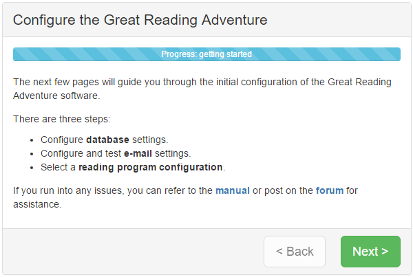

Step-by-step configuration
==========================

Once the GRA software is installed and you access the Web site, you should see the initial configuration screen:

As you use the progress through configuration, you'll need to provide the information collected from the `requirements checklist`_.

.. _requirements checklist: ../../installation/requirements-checklist

.. NOTE::
   The configuration process performs a check to verify your database users are in the appropriate database groups (i.e. ``db_owner`` for the owner user, ``db_datareader`` and ``db_datawriter`` for the regular user). If you are unable to add the database users to those groups, you can override this check by adding a line to the ``Web.config`` file in the ``<appSettings>`` section.

   .. code-block:: xml

      <add key="IgnoreMissingDatabaseGroups" value="true" />

   For more information on ``Web.config`` settings see the `technical configuration details`_ section.

.. _technical configuration details: ../../technical/configuration-details

The last step will tell you the login and password to access the ControlRoom. Make a note of it before continuing.

ControlRoom
-----------

Once you're through the step-by-step configuration, you'll administered the GRA through the ControlRoom interface. It is accessible by appending ``/ControlRoom/`` to the end of the URL to your installation of the GRA. After the step-by-step configuration, you will be redirected to the ControlRoom login screen automatically.

The main system administrator account is ``sysadmin`` and the first time you log in to the ControlRoom, the software will force you to change your password.
