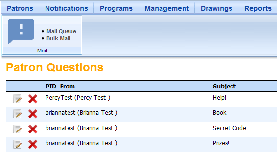
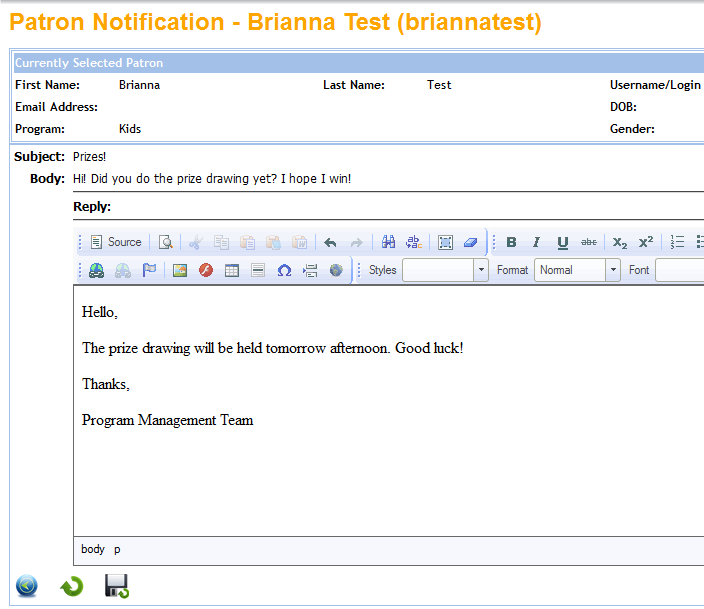
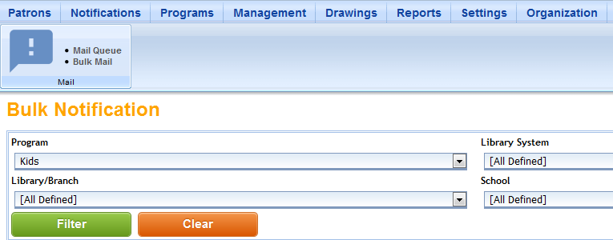
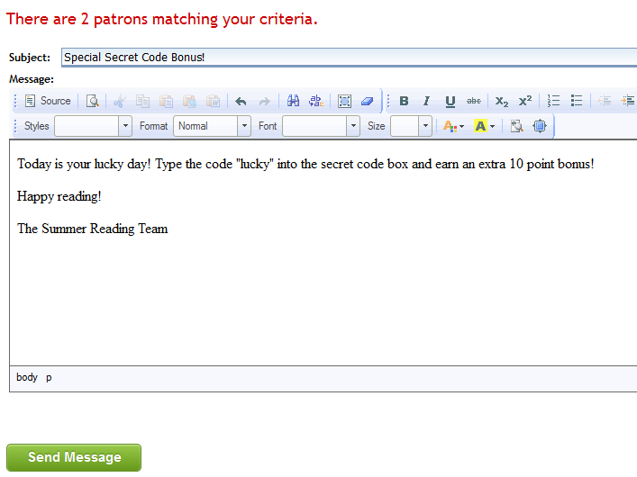

# Mail

Mail (or Notifications) is where you will find messages sent by participants with questions about the program or their accounts.  You can also send bulk messages out to multiple participants at the same time from this menu.

From the Control Room, click **Notifications**. You will immediately see the list of pending messages. To read a message, click on the Edit icon next to the sender's name.

You'll see the participant's details at the top of the page, followed by their message. Type your reply in the box, then click the **Save Back** icon to send the message and return to the message list.

Once you have sent your reply, the original message will be deleted from the message list.

## Bulk Mail ##

There are times when you may want to send a message to every participant in the program, or just in a specific age group. You can do this by using the **Bulk Mail** feature.

Under the **Notifications** heading, click **Bulk Mail**. Choose the filters you want to use, or leave the fields blank to send a message to all program participants. Click the green **Filter** button.

After filtering, you will see the number of participants that meet the criteria. Type your message and click the green **Send** button to send your message. If the message is going to a large number of users, it may take a little time to send.

