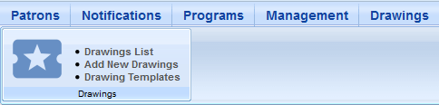
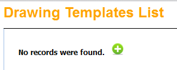
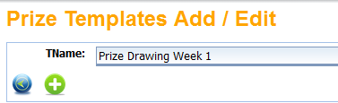
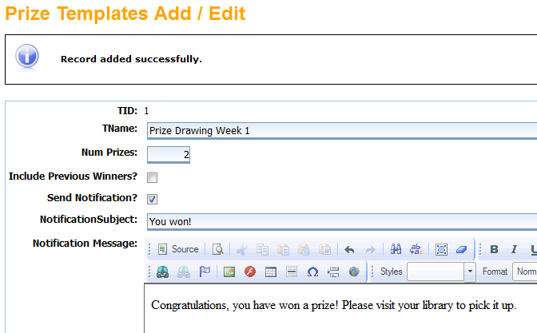
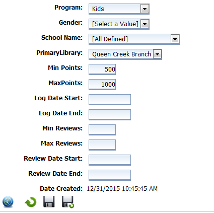
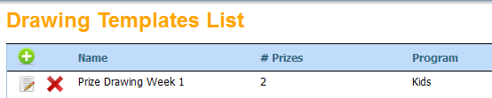
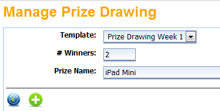
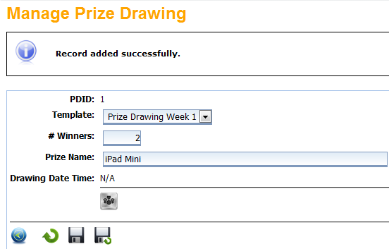
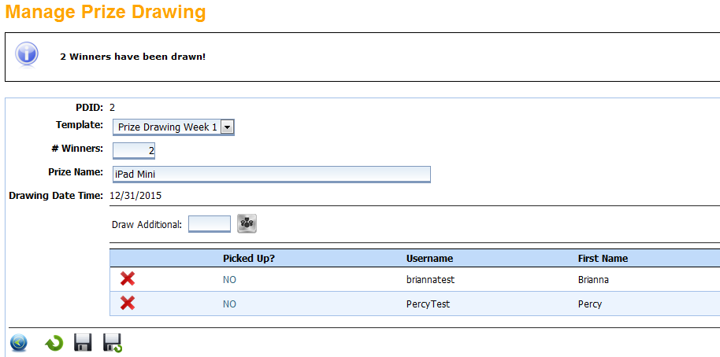

# Prize Drawings #

There are two parts to running a prize drawing for your library.

The first step is creating the template. Click on the **Drawings** tab, and then select **Drawing Templates**.

Click the green **+** to create a new template.

Name your template and click the green **+** to continue.

At the top of the page you'll see a message stating that the record was saved successfully, but the template is not yet complete.

Enter the number of winners you want to draw, and decide if you want to include previous winners. If you check the **Send Notification** box, a message will automatically go to the winners of the drawing. Uncheck the box if you'd rather contact the winners yourself.

Choose the program (age group) you want, and choose your library. You can also filter by gender or school. Enter your min and max points, and the logging start and end dates. These filters are optional, you can leave them blank if you like. When you are finished, click on the **Save** icon.

Your completed template should now appear in the **Drawings Templates List.**

Next, go back to the **Drawings** menu at the top of the page and choose **Add New Drawings**.

Choose the template you just created from the drop-down menu. Enter the number of winners you'd like to select, and enter the name of the prize. Click the green **+** to continue.

At the top of the page you'll see a message stating that the record was added successfully, but the drawing is not yet complete. Click the **Draw** button (under the **Drawing Date Time** field).

The message at the top of the page will tell you that the winners were drawn successfully. You will see the winners' names listed below, along with the option to **Draw Additional** winners. If you want to draw additional winners with the same filters for the same prize, enter the number and click the **Draw** icon again.

Click the **Save** icon to save the results of this Drawing.

The winners will receive a notification in their **Mail** box telling them they have won.
