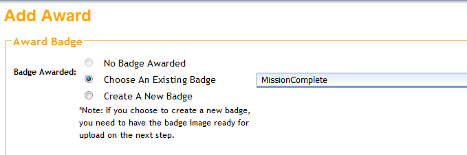

# Badge Awards

Badge Awards are special badges that can be awarded when a target is reached. They can be awarded when a user earns a particular number of points, or when the user earns a combination of particular badges.

From the Control Room, click on the **Management** tab. Then click **Badge Awards**.

Click on the green **+** at the top of the page to create a new Badge Award.

Give your Badge Award a name that users will see. Enter the number of points that will trigger the badge being unlocked OR check the boxes of the badges that must be earned to trigger the badge being unlocked. Choose your library, program, and school information based on how you want to award the badge. You can leave the fields blank if you want the Badge Award to be available to all participants. Click the green arrow to continue.

Next, choose the badge to be earned. Select a badge from the drop-down menu if you will be using an existing badge. To make a new badge, choose **Create A New Badge**.

If you choose to create a new badge, give your badge a **Control Room Name**. **Patron Web Name** is what the user will see. You can also type a message that the user will see when the Badge Award is earned. Click the green arrow to continue.

To send a notification stating that the user has earned this Badge Award, click the **Send Notification** box, then add a subject and a message to the user. If you are awarding a physical prize with this Badge Award, click the box.  Click the green arrow at the bottom to continue.

Check the boxes for your Badge Award filters (determines how it will show up in the Badge Gallery): Badge Category, Age Group, Branch Library, and Location.

Upload an existing badge image by clicking **Browse** and then **Upload**. Click the green arrow to continue.

When you have successfully created and saved your Badge Award, you should see this message:

