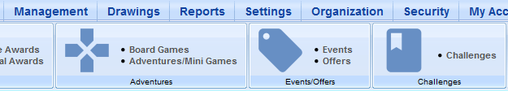
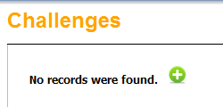
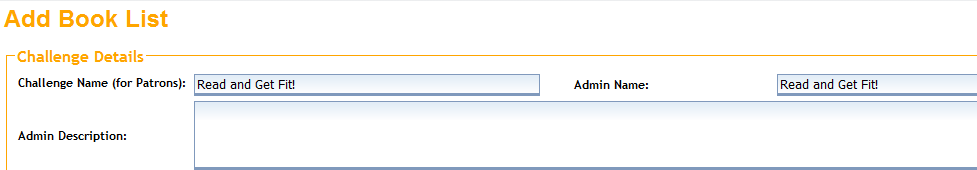
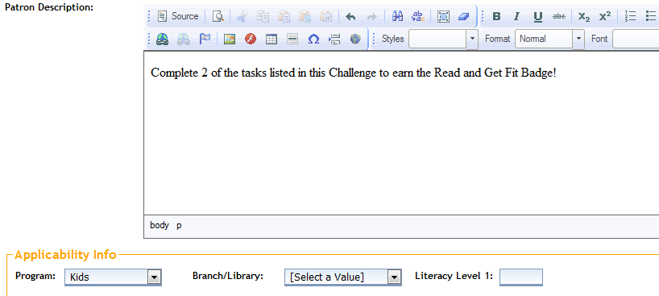
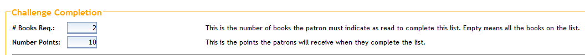
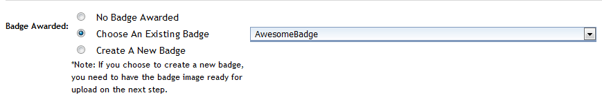
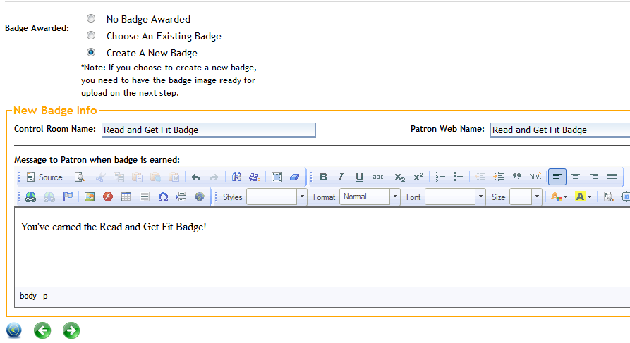
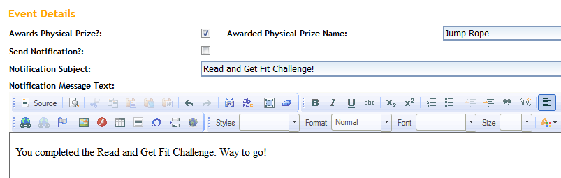
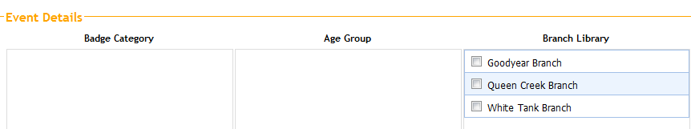
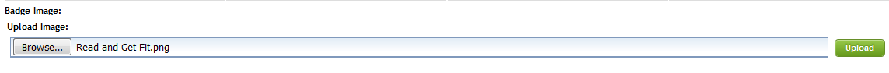

# Challenges #

Challenges are activities that participants can complete. Each Challenge can be comprised of a mix of books to read and tasks to complete, such as "Read a book about dogs," or "Take a nature walk in your neighborhood."

From the Control Room, click on the **Management** tab. Then click **Challenges**.

Click on the green **+** at the top of the page to create a new Challenge.

In the **Challenge Name (for Patrons)** field, give your Challenge a name that participants will see. In the **Admin Name** field, choose a name for staff to see (it can be the same if you like). You can leave the **Admin Description** field blank.

**Patron Description** is the text users will see when clicking on your Book List. Under **Applicability Info**, choose the program (age group) and your library if you like. You can leave the fields blank if you want the Challenge to be available to participants of all ages. Click the green arrow to continue to the next step.

Enter the number of items (tasks, books, etc.) required to complete the Challenge. Then enter the number of points that will be awarded when the Challenge is complete.

Next, choose the badge to be earned. Select a badge from the drop-down menu if you will be using an existing badge. To make a new badge, choose **Create A New Badge**.

If you choose to create a new badge, give your badge a **Control Room Name**. **Patron Web Name** is what the user will see. You can also type a message that the user will see when the Challenge badge is earned. Click the green arrow to continue.

To send a notification stating that the user has earned this Challenge badge, click the **Send Notification** box, then add a subject and a message to the user. If you are awarding a physical prize with this Challenge, click the box. Click the green arrow at the bottom to continue.

Check the boxes for your Challenge badge filters (determines how it will show up in the Badge Gallery): Badge Category, Age Group, Branch Library, and Location.

Upload an existing badge image by clicking **Browse** and then **Upload**. Click the green arrow to continue.

When you have successfully created and saved your Challenge, you should see this message:
