# Events #

Events can be used to feature the events at your library. Participants can see the event details, and view the badge that they can earn by entering the secret code they will collect at the event. The Events feature can also be used to create secret codes for multiple uses during your reading program. Want to put a secret code on your check out receipts for redemption throughout your program? Simply create an Event that runs for the length of your program with that secret code.

From the Control Room, click on the **Management** tab. Then click **Events**.

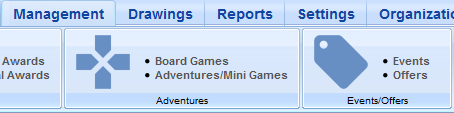

Click on the green **+** at the top of the page to create a new Event.

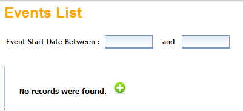

First, give your Event a title. Then add the start date, start time, end date, and end time (optional). You can also add a short description of the Event (optional), as well as a more detailed Event description.

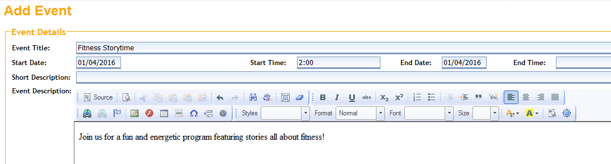

Choose your library from the drop-down menu, and then click the green arrow to continue.

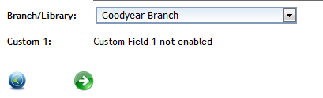

Enter a secret code that users will log after attending your Event. When creating a secret code, keep these things in mind:

- Avoid using spaces, underscores or dashes
- Use one word, all in lowercase letters
- If using numbers, place them at the beginning or end

Enter the number of points that will be awarded for attending the Event.

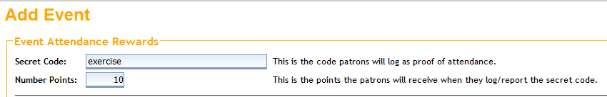

Next, choose the badge to be earned. Select a badge from the drop-down menu if you will be using an existing badge. To make a new badge, choose **Create A New Badge**.

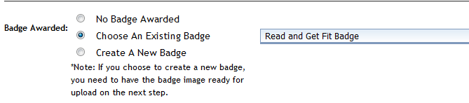

If you choose to create a new badge, give your badge a **Control Room Name**. **Patron Web Name** is what the user will see. You can also type a message that the user will see when the Event badge is earned. Click the green arrow to continue.

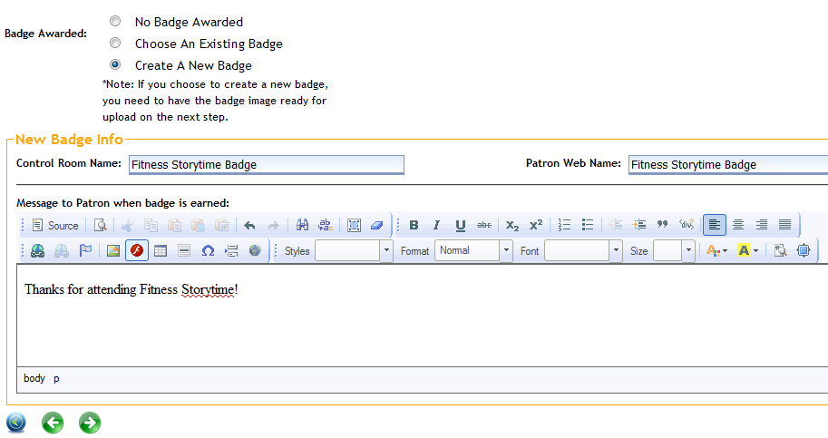

To send a notification stating that the user has earned this Event badge, click the **Send Notification** box, then add a subject and a message to the user. If you are awarding a physical prize with this Event badge, click the box.  Click the green arrow at the bottom to continue.

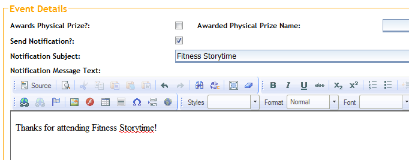

Check the boxes for your Event badge filters (determines how it will show up in the Badge Gallery): Badge Category, Age Group, Branch Library, and Location.

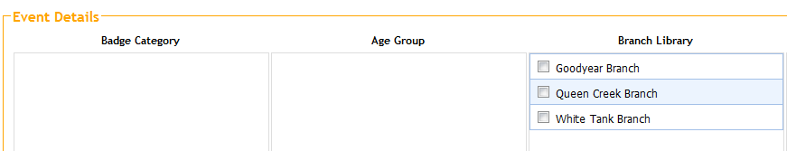

Upload an existing badge image by clicking **Browse** and then **Upload**. Click the green arrow to continue.

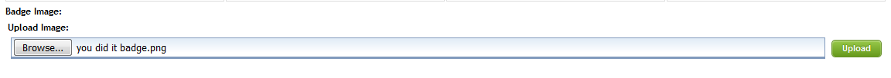

When you have successfully created and saved your Event, you should see this message:

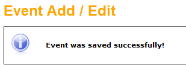
