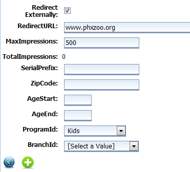

# Offers #

If you have received coupons or special offers from your community partners that you'd like to share digitally with participants, Offers is a great way to do it.

From the Control Room, click on the **Management** tab. Then click **Offers**.

Click on the green **+** at the top of the page to create a new Offer.

First, check the **Enabled** box to make your Offer active. Give your Offer an **Admin Name** that staff will see, and a **Title** that participants will see (they can be the same if you like).

If your Offer is located on a website outside of this program, check the **Redirect Externally** box and enter a **Redirect URL**. In the **MaxImpressions** field, enter the number of Offers that are available, ex: if an organization gives you 500 discount coupons, enter “500” in the box. Enter a zip code, ages, program and library if you like, or leave these fields blank if you'd like the Offer to appear for all participants. Click the green **+** to continue.

You should see a message that says “Record added successfully” at the top of the screen. This means that the information has been added to the database, but to complete the Offer you still need to add a photo. Click **Browse** to find your file, and then **Upload** to add it to the record.

Then click the **Save** icon at the bottom of the page to save your Offer.
